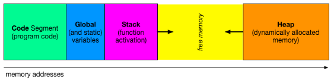
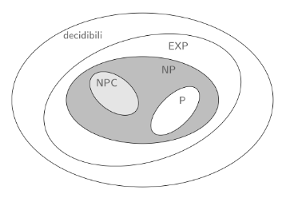

# APPUNTI DI STRUTTRE DATI E ALGORITMI

## CAP 01 - INTRODUZIONE

### ALGORITMO

- Definizione: un algoritmo è un procedimento sistematico che consente di ottenere un risultato eseguendo, in un determinato ordine, un insieme di passi elementari corrispondenti ad azioni scelte solitamente da un insieme finito

- Caratteristiche fondamentali:

  - a sequenza di istruzioni deve essere finita (finitezza della descrizione, finitezza del procedimento, finitezza dei singoli passi)
  - le istruzioni devono essere eseguibili materialmente (realizzabilità)
  - le istruzioni devono essere espresse in modo non ambiguo (non ambiguità)
  - il procedimento deve portare ad un risultato (effettività)

- Altre proprietà desiderabili

  - un algoritmo dovrebbe funzionare correttamente anche variando alcuni aspetti del problema (generalità)
  - il numero di azioni eseguite per la soluzione del problema dovrebbe essere minimo (efficienza)
  - la sequenza di azioni che verranno eseguite per ogni insieme di dati dovrebbe essere prevedibile (determinismo)

#### STRUTTURE DATI

- Organizzazione efficiente dei dati
- Servono a rappresentare i dati di problemi complessi strutturando i dati elementari (bit, caratteri, interi, strighe, ...)
- Rappresentano istanze di problemi computazionali reali e concreti

#### ALGORITMI E PROBLEMI

Un algoritmo risolve un problema

- dal punto di vista matematico è una corrispondenza univoca fra spazio delle istanze e spazio delle soluzioni
- l'algoritmo descrive il rpocedimento che, una volta affidato ad un "esecutore", consente di "calcolare" la corripondenza

#### ALGORITMI E PROGRAMMI

Un programma è l'implementazione di un algoritmo in un linguaggio di prgrammazione
Sostanzialmente è la concretizzazione di un algoritmo in modo che sia eseguibile da un computer

---

### PROBLEMI DECIDIBILI E INDECIDIBILI

#### PROBLEMI DECIDIBILI

Un problema è detto decidibile (o calcolabile) se esiste un algoritmo che per ogni sua istanza sia in grado di terminare la sua esecuzione pervenendo ad una soluzione

#### PROBLEMI INDECIDIBILI

Un problema è indecidibile (o non calcolabile) se nessun algoritmo sia in grado di terminare la sua esecuzione pervenendo ad una soluzione su ogni sua istanza

#### INDECIBILITA'

Un problema è indecidibile se non esiste alcun algoritmo di risoluzione che termina su ogni input restituendo un risultato

## CAP 02 - ORGANIZZAZIONE DELLA MEMORIA, CHIAMATE DI FUNZIONI, RICORSIONE

### L'ORGANIZZAZIONE DELLA MEMORIA

La memoria in un programma C è organizzata come lo schema seguente

   

Dove ogni blocco svolge una funzione differente e specifica:

1. Code Segment
   - Contiene il codice eseguibile del programma
   - E' tipicamente una regione di sola lettura, in modo da prevenire modifiche accidentali o intenzionali al codice
   - Può essere condiviso tra processi che eseguono lo stesso programma per ottimizzare la memoria
2. Variabili Globali e Statiche
   - In questa sezione si trovano:
      - Le variabili globali (visibili in tutto il programma)
      - Le variabili statiche, che mantengono il loro valore tra le diverse chiamate di funzione
   - E' diviso in:
      - Dati inizializzati: variabili con valori assegnati esplicitamente
      - Dati non inizializzati: variabili inizalizzate implicitamente a 0
   -Questa memoria è allocata all'avvio del programma e liberata alla sua terminazione
3. Stack
   - Gestisce i **Record di attivazione** delle funzioni
   - Ogni funzione che viene chiamata crea un nuovo record di attivazione nello stack
   - segue la politica LIFO (Last In First Out)
   - E' gestito automaticamente e ha dimensione limitata. un uso eccessivo prota a un stack overflow
4. Free Memory
   - Questa regione rappresenta la memoria non ancora utilizzata
   - Funziona come un'area di separazione tra lo stack e l'heap
   - Può essere espansa o ridotta dinamicamente a seconda delle esigenzxe del programma
5. Heap
   - Utilizzato per l'allocazione dinamica della memoria durante il runtime
      - Es: `malloc()`, `calloc()`, `realloc()` e deallocazione con `free()`
   - La gestione è manuale: il programmatore deve liberare esplicitamente la memoria per evitare **memory leak**
   - Si espande verso l'alto (verso l'area libera), mentre lo stack si espande verso il basso

#### RECORD DI ATTIVAZIONE

Ciascuna funzione crea un suo spazio specifico di emmorizzazione nello *stack* detto **record di attivazione**

Esso conteiene tutte le variabili locali della funzione, i suai parametri e i valori di ritorno

---

### LA RICORSONE

Una funzione è detta *ricorsiva* se nella sua definizione compare un riferiemtno (chiamata) a se stessa

- La funzione ricorsiva sa risolvere direttamente dei casi particolari del problema, detti casi base, in tal caso è in grado di restituire immediatamente il risultato
- se invece le vengono passati dei dati che non costituiscono uno dei casi di base chiama se stessa passando dei dati *"ridotti"* o *"semplificati"*

Ad ogni chiamata i dati si riducono così ad arrivare, ad un certo punto, ad uno dei casi base

#### RICORSIONE: MECCANISMO COMPUTAZIONALE

Quando la funzione chiama se stessa, la sua esecuzione si sospende per eseguire la nuova chiamata

- L'esecuzione riprende quando la chiamata interna termina
- La sequenza di chiamate ricorsive termina quando quella più annidata incontra uno dei casi base

Ogni chiamata alloca sullo *stack* nuove istanze dei parametri e delle variabili locali all'interno del record di attivazione

#### RICORSIONE E INDUZIONE

La ricorsione è basata sul principio di induzione matematica:

- Se una proprietà $P$ vale per $n = n_0$ (**caso base**)
- e si può provare che assumendola valida per $n$, vale anche per $n + 1$ (**passo induttivo**)
- allora $P$ vale per ogni $n \geq n_0$

Analogamente, per risolvere il problema con un approccio ricorsivo comporta:

- l'identificazione del **caso base** in cui la soluzione sia nota
- la capacità di esprimere il caso generico in termini dello stesso problema ma in uno o più casi più semplici

#### CONSIDERAZIONI FINALI SULLE FUNZIONI RICORSIVE

##### PRO E CONTRO DELLE FUNZIONI RICORSIVE

Pro:

- Metodo particolarmente utile su strutture dati inerentemente ricorsive (alberi, grafi)
- Qualora applicabili,  le funzioni ricorsive sono più chiare (ed eleganti), più semplici, più brevi e più comprensibili rispetto alle versioni iterative

Contro:

- Le risorse di memoria richieste sono generalmente superiori a quelle della corrispondente soluzionie iterativa
  - richiede temp per la gestione dello stack
  - richiede memoria

##### QUANDO UTILIZZARE LA RICORSIONE

- In generale qualunque problema ricorsivo può essere risolto in modo non ricorsivo (iterativo)
- E' utile quando la soluzione iterativa è difficile da individuare o in generale più complessa
- In caso sia possibile farlo, definire una versione con ricorsione in coda è certamente da preferirsi

## CAP 03 - TRATTABILITA' E COMPLESSITA' COMPUTAZIONALE

### COMPLESSITA'

#### Decidibilità

- Un problema è **decidibile** se esiste un algoritmo che fornisce una risposta corretta ("sì" o "no") per ogni input valido in **tempo finito**.
- Si concentra sulla **esistenza** di una soluzione computabile.
- **Esempio**: Stabilire se una stringa appartiene a un linguaggio regolare.

#### Trattabilità

- Un problema è **trattabile** se è possibile risolverlo in un tempo **ragionevole**, tipicamente polinomiale rispetto alla dimensione dell'input (classe **P**).
- Si concentra sull'**efficienza** della soluzione.
- **Esempio**: Ordinare una lista di numeri è trattabile perché ci sono algoritmi efficienti (es. QuickSort).

#### Sintesi

- **Decidibilità**: riguarda **se** un problema può essere risolto.
- **Trattabilità**: riguarda **quanto efficacemente** può essere risolto.

#### Algoritmi Polinomiali ed Esponenziali

**Definizione**: Un algoritmo è detto polinomiale, nella dimensione del suo input $n$, se esistono due costanti $c$, $n_0 > 0$ tali che il numero di passi elementari da esso eseguiti è al più $n^c$, per ogni input di dimensione $n$ e per ogni $n > n_0$.

**Definizione**: Un algoritmo è detto esponenziale, nella dimensione del suo input $n$, se esistono due costanti $c$, $n_0 > 0$ tali che il numero di passi elementari da esso eseguiti è al più $c^n$, per ogni input di dimensione $n$ e per ogni $n > n_0$.

**Problema trattabile**: esiste un algoritmo polinomiale che lo risolve

**Problema intrattabile**: non esiste un algoritmo polinomiale che lo risolve

---

### CLASSI DI COMPLESSITA' DEI PROBLEMI

   

- $P$ classe dei problemi risolvibili in tempo polinomiale
- $EXP$ classe dei problemi risolvibili in tempo esponenziale
- $NP$ classe dei problemi per i quali verificare una soluzione richiede tempo polinomiale
- $NPC$ classe dei problemi completi per $NP$, detti $NP-Completi$

---

### ANALISI DELLA COMPLESSITA'

Misura di performance di un algoritmo espresse in funzione della dimensione dei dati in input $n$

- tempo: numero di operazioni RAM (elementari) eseguite
- spazio: numerodi celle di memoria occupate

Complessità o costo comutazionale $f(x)$ in tempo e spazio di un problema $Π$:

- caso pessimo o peggiore: costo massimo fra tutte le istanze di $Π$ aventi dimensione dei dati pari a $n$
- caso medio: costo mediato tra tutte le istanze di $Π$ aventi dimensione pari a $n$
- caso ottimo: costo minimo fra tutte le istanze di $Π$ aventi dimensione dei dati pari a $n$

#### Notazione asintotica e ordini di complessità

##### Notazione Asintotica

La **notazione asintotica** descrive il comportamento di un algoritmo quando la dimensione dell'input (\(n\)) cresce verso l'infinito. Fornisce una stima della crescita del tempo di esecuzione o dello spazio richiesto.

##### Principali Notazioni

1. **Limitazione Superiore $O(f(n))$**:  
   Rappresenta un limite superiore asintotico. Indica il caso peggiore della crescita dell'algoritmo.  
   - Formalmente:  
     $$
     g(n) \in O(f(n)) \quad \text{se e solo se esistono costanti } c > 0 \text{ e } n_0 > 0 \text{ tali che: } g(n) \leq c \cdot f(n) \quad \forall n \geq n_0
     $$
   - **Esempio**: Se $f(n) = 3n^2 + 5n + 2$, allora $f(n) \in O(n^2)$, perché la crescita è dominata dal termine $n^2$.

2. **Limitazione inferiore $Ω(f(n))$**:  
   Rappresenta un limite inferiore asintotico. Indica la crescita minima dell'algoritmo.  
   - Formalmente:  
     $$
     g(n) \in Ω(f(n)) \quad \text{se e solo se esistono costanti } c > 0 \text{ e } n_0 > 0 \text{ tali che: } g(n) \geq c \cdot f(n) \quad \forall n \geq n_0
     $$
   - **Esempio**: Se \$f(n) = 3n^2 + 5n + 2$, allora $f(n) \in Ω(n^2)$.

3. **Limitazione $Θ(f(n))$**:  
   Indica che un algoritmo cresce esattamente al ritmo indicato.  
   - Formalmente:  
     $$
     g(n) \in Θ(f(n)) \quad \text{se e solo se esistono costanti } c_1, c_2 > 0 \text{ e } n_0 > 0 \text{ tali che: } c_1 \cdot f(n) \leq g(n) \leq c_2 \cdot f(n) \quad \forall n \geq n_0
     $$
   - **Esempio**: Se \(f(n) = 3n^2 + 5n + 2\), allora \(f(n) \in Θ(n^2)\).

---

#### Ordini di Complessità

Gli ordini di complessità rappresentano le classi di crescita degli algoritmi. Ecco alcuni esempi comuni:

1. **Costante $O(1)$**:
   - Il tempo di esecuzione non dipende dalla dimensione dell'input.  
   - **Formula**:  
     $$
     T(n) = c
     $$
   - **Esempio**: Accesso diretto a un elemento in un array, es. $A[i]$.

2. **Logaritmica $O(\log n)$**:
   - La complessità cresce molto lentamente con l'aumento dell'input.  
   - **Formula**:  
     $$
     T(n) = c \cdot \log n
     $$
   - **Esempio**: Ricerca binaria.

3. **Lineare $O(n)$**:
   - La complessità cresce in modo proporzionale alla dimensione dell'input.  
   - **Formula**:  
     $$
     T(n) = c \cdot n
     $$
   - **Esempio**: Scansione di un array.

4. **Lineare-logaritmica $O(n \log n)$**:
   - Tipico degli algoritmi di ordinamento efficienti.  
   - **Formula**:  
     $$
     T(n) = c \cdot n \cdot \log n
     $$
   - **Esempio**: MergeSort.

5. **Quadratica $O(n^2)$**:
   - La complessità cresce quadraticamente rispetto all'input.  
   - **Formula**:  
     $$
     T(n) = c \cdot n^2
     $$
   - **Esempio**: Confronto di tutte le coppie in un array (es. BubbleSort).

6. **Esponenziale $O(2^n)$**:
   - La complessità cresce esponenzialmente con l'input.  
   - **Formula**:  
     $$
     T(n) = c \cdot 2^n
     $$
   - **Esempio**: Risoluzione di problemi con enumerazione di tutte le sottoinsiemi.

7. **Fattoriale $O(n!)$**:
   - La complessità cresce estremamente rapidamente.  
   - **Formula**:  
     $$
     T(n) = c \cdot n!
     $$
   - **Esempio**: Problema del commesso viaggiatore (con approccio brute force).

### Definizioni

- **Notazione asintotica**: descrive come il tempo o lo spazio richiesto cresce con l'input.
- **Ordini di complessità**: classificano gli algoritmi in base al costo computazionale.
- La scelta di un algoritmo dipende dall'equilibrio tra efficienza e necessità pratiche.

### Proprietà della notazione asintotica

- Riflessività: per ogni costante $c$, $c \cdot f(n)$ è $O(f(n))$ (lo stesso per Ω e Θ)
- Transitività: se $g(n)=O(f(n))$ e $f(n)=O(h(n))$ allora $g(n)=O(h(n))$ (lo stesso per Ω e Θ)
- Simmetria: $g(n)=Θ(f(n))$ se e solo se $f(n)=Θ(g(n))$
- Simmetria trasposta: $g(n)=O(f(n))$ se e solo se $f(n)=Ω(g(n))$
- Somma: $g(n)+f(n)=O(max \{f(n),g(n)\})$ (lo stesso per Ω e Θ)
- Prodotto: $g(n)=O(f(n))$ , $h(n)=O(q(n))$ allora $g(n) \cdot h(n)=O(f(n) \cdot q(n))$ (lo stesso per Ω e Θ)

---

### ANALISI STRUTTURALE

Per gli algoritmi descritti in un linguaggio imperativo (come il C) è possibile definire delle regole che consentono di stimare la loro complessità computazionale direttamente dalla struttura del programma stesso

- La complessità di una sequenza di istruzioni è data dalla somma delle complessità delle singole istruzioni della sequenza
- Il costo di una chiamata a funzione è il costo del suo corpo più il passaggio dei parametri (qualora siano a loro volta delle operazioni non elementari)
  - le funzioni ricorsive saranno trattate a parte
- La complessità di una condizione `if(guardia) blocco 1 else blocco 2` è data da $costo(guardia) + max \{costo(blocco1), costo(blocco2)\}$
- La complessità di un ciclo con un numero determinato di iterazioni `for ( i = 0; i < m; i = i + 1) corpo` è data da $\sum_{i=0}^{m-1} costo(corpo)_i + 2costante$: costo del corpo all'iterazione $i$, più due volte un costo costante dovuto dalla valutazione di inizializzazione/incremento e condizione
- La complessità di un ciclo con un numero indeterminato di iterazioni `while (guardia) corpo` è data da $\sum_{i=0}^{m-1} costo(guardia)_i + costo(corpo)_i + costo(guardia)_m$ dove $m$ è il massimo numerodelle volte in cui la guardia risulta soddisfatta

#### Esempio di analisi strutturale

```c
int min_naive(int a[], int n) {        // Costo, Num. ripetizioni
   int i, j;                           // 0 1
   bool is_min;                        // 0 1
   for (i = 0; i < n; i++) {           // 2c1 n
      is_min = true;                   // c2 n
      for (j = 0; j < n ; j++)         // 2c3 n * n
         if (a[i] > a[j])              // c4 n * n
            is_min = false;            // c5 n * n
         if (is_min)                   // c6 n
            return a[i];               // c7 1
   }
}
```

$$
\begin{align}
T(n)&=2c_1 \cdot n+c_2 \cdot n + 2c_3 \cdot n \cdot n + c_4 \cdot n \cdot n + c_5 \cdot n \cdot n + c_6 \cdot n + c_7 =\\
&=n^2(2c_3 + c_4 + c_5) + n(2c_1 + c_2 + c_6) + 1(c_7)\\
&=n^2c'+nc''+c'''=\\
&=O(n^2)+O(n)+O(1)=O(n^2)
\end{align}
$$

# da finire

## CAP 04 - SEQUENZE LINEARI E ALLOCAZIONE DINAMICA DELLA MEMORIA

### SEQUENZE LINEARI

- Sono delle **strutture dati astratte** costituite da $n$ elementi $a_0,a_1,...,a_{n-1}$ dove $a_j$ è il $(j+1)$-esimo elemento, $0 \leq j \leq n-1$
- E', in genere, rilevante il loro ordine relativo
- Due modalità di accesso:
  - diretto: dato $j$ si accede solo ad $a_j$ (**array**)
  - sequenziale: dato $j$ è necessario accedere ad $a_0,a_1,...,a_{n-1}$ per poi accedere ad $a_j$ (**liste**)

---

### ALLOCAZIONE DINAMICA DELLA MEMORIA IN C

La gestione dello heap da parte del programmatore avviene, in linguaggio C, attraverso le seguenti istruzioni:

- `void* malloc(int n)` alloca nella heap un numero di byte pari a n e restituisce l'indirizzo di memoria dello spazio allocato sottoforma di un puntatore generico
- `void free(void*)` dealloca lo spazio di memoria inizialmente puntato dal puntatore passato come parametri

Si osservi che il valore restituito è di tipo  `void*`:

- questa scelta è stata fatta per rendere la funzione indipendente dal tipo di dato effettivamente allocato (la funzione riserva `n` bytes per il programma)
- per poter utilizzare proficuamente quell'area di memoria sarà necessario convertire il `void*` nel tipo opportuno (ad esempio `int*` se destinato a interi, ecc.)

Come specificare a `malloc()` di quanti byte avrò effettivamente bisogno senza imparare a memoria la dimensione di tutti i tipi di dato?

- la funzione `sizeof(<tipo_di_dato>)` restituisce il numero di byte necessari per memorizzare il tipo di dato passato come parametro (es., `sizeof(int)` restituirà il numero di byte necessari per memorizzare un intero)

Per l'elaborazione è neccessario anche poter rappresentare un puntatore non inizializzato

- la costante simbolica `NULL` , di tipo puntatore, indica un puntatore che non punta a nessuna locazione di memoria

---

### ARRAY

#### Allocazione in memoria degli array

La rappresentazione di un array avviene attraverso l'indirizzo $a$ del suo primo elemento I suoi elementi sono memorizzati in posizioni consecutive, multiple della dimensione dei dati memorizzati

- **vantaggi**: tempo di accesso costrante
- **svantaggi**: dimensione fissata, a meno del trucco di sovradimensionare l'array (dimensione *fisica* vs *logica*)

#### Array dinamici

Alcuni linguaggi di programmazione (C++, Java, Python, C#) prevedono array che possono essere creati (e ridimensionati) dinamicamente, cerchiamo di farlo anche in C

```c
float* alloca_vettore(int n) {
   float* a = (float*)malloc(n * sizeof(float));
   assert(a != NULL);
   // la memoria potrebbe non essere allocata
   // e si dovrebbe gestire l'errore
   return a;
}

void dealloca_vettore(float* a) {
   free(a);
   a = NULL;
}
```

La funzione `alloca_vettore` restituisce “il vettore” appena allocato (attraverso il puntatore al suo primo elemento)

- ciò è lecito / possibile perché il vettore è allocato nello heap
- non sarebbe corretto se il vettore fosse dichiarato come variabile locale della funzione (e, di conseguenza, allocato sullo stack), perché quando la funzione termina la memoria viene rilasciata

L'operazione caratteristica degli array dinamici è quella di ridimensionamento:

```c
float* ridimensiona_vettore(float* a, int n, int d) {
   // la funzione realloc() alloca un nuovo spazio di memoria
   // e copia i valori precedentemente memorizzati nell'array:
   // richiede tempo O(min{n, d}), pari al numero di elementi da copiare
   float* a = (float*)realloc(a, d * sizeof(float));
   assert(a != NULL);
   return a;
}
```

Il codice della `realloc` coincide, **concettualmente**, con (i) un'allocazione di un nuovo vettore, (ii) la copia dei valori precedentemente memorizzati nel vettore originale e (iii) la deallocazione del vettore originale.

**Osservazione** $d$ può essere più grande o più piccolo di $n$ a seconda che vogliamo estendere o ridurre il vettore originario

L'operazione tipica di ridimensionamento su di un array è quella di aggiunta o di eliminazione di una posizione in fondo all'array

- Aggiunta di un nuovo elemento:
  - Alloca lo spazio per un nuovo array $b$ di dimensione $n+1$: $O(1)$
  - Copia gli elementi di $a$ in $b$: $O(n)$
  - Dealloca dalla memoria: $O(1)$
  - Ridenomina $b$ come $a$: $O(1)$

- Rimozione di un elemento esistente:
  - Alloca lo spazio per un nuovo array $b$ di dimensione $n-1$: $O(1)$
  - Copia gli elementi di $a$ in $b$: $O(n-1) = O(n)$
  - Dealloca $a$ dalla memoria: $O(1)$
  - Ridenomina $b$ come $a$: $O(1)$

**Inefficiente**: richiede tempo totale $O(n)$

#### Approccio "Ammortizzato"

È possibile ottenere qualcosa di più efficiente quando le operazioni di inserimento/cancellazione degli elementi in fondo all'array sono più d'una?
**Idea**: usiamo un sovradimensionamento come per gli array memorizzati sullo stack (lasciando degli elementi **fisici** liberi per ulteriori operazioni)

- per ciascun array necessitiamo di mantenere due informazioni dimensionali:
  - $n$, il numero di elementi significativi (**dimensione logica**)
  - $d>n$, il numero di elementi allocati in memoria, compresi quelli non utilizzati (**dimensione fisica**)
- in particolare decidiamo di effettuare operazioni di aumento o diminuzione raddoppiando o dimezzando la dimensione dell'array

```c
// estende il vettore di un elemento
float* estendi_vettore(float a[], int* n, int* d) {
   *n = *n + 1;
   if (*n >= *d) { // raddoppio
      a = ridimensiona_vettore(a, *d, 2 * (*d));
      *d = 2 * (*d);
   }
   return a;
}

// riduce il vettore di un elemento
float* riduci_vettore(float a[], int* n, int* d) {
   *n = *n - 1;
   if (*d > 1 && n <= d / 4) { // dimezzamento
      a = ridimensiona_vettore(a, *d, *d / 2);
      *d = *d / 2;
   }
   return a;
}
```

Entrambe le operazioni anno complessità **virtualmente costante**

La logica vista nelle operazioni di estensione e riduzione del vettore dinamico richiede che per rappresentarlo sia ncessario mantenere (e gestire) contemporaneamente 3 informazioni:

- `a` il puntatore all'area di memoria dell'array (primo elemento)
- `n` la dimensione logica dell'array
- `d` la dimensione fisica dell'aray

```c
float* alloca_vettore_dinamico(int n, int* d) {
   float* a = (float*)malloc(n * 2 * sizeof(float));
   assert(a != NULL)
   *d = n * 2;
   return a;
}
```

Ciò comporta che sia necessario, oltre che modificarle coerentemente, “portarsele dietro” in tutte le funzioni di manipolazione

#### Implementazione Ingegnerizzata

Rappresentiamo tutte le informazioni che descrivono la struttura dati attraverso un **record**, detto **descrittore**, che combina insieme tutte le informazioni necessarie

```c
typedef struct /* anonima */ {
   // Puntatore allo spazio di memoria allocato per il vettore nello heap
   float *dati;
   // Dimensione logica del vettore: numero di elementi effettivi
   int dimensione;
   // Dimensione fisica del vettore: numero di elementi allocati nello heap
   int capacita;
} vettore_dinamico;
```

**Convenzione**: tutte le operazioni di manipolazione restituiscono il nuovo descrittore (esplicitamente o attraverso il passaggio per riferimento)

**Nota**: l'istruzione `typedef <tipo> <nome_alias>` crea un alias per un determinato tipo di dato consentendo di omettere `struct <nome_struct>` quando dichiariamo le variabili

##### Funzioni di Manipolazione (`array.h`)

```c
vettore_dinamico crea_vettore_dinamico(int n) {
   vettore_dinamico v;
   // non ha senso creare vettori di dimensione negativa
   assert(n >= 0);
   if (n > 0) {
      // alloca lo spazio per i dati, memorizzandone il puntatore nel descrittore
   v.dati = (float*)malloc(2 * n * sizeof(float));
      // verifica che l'allocazione abbia avuto buon esito
      assert(v.dati != NULL);
   }
   else
   {
      v.dati = NULL;
   }
   v.dimensione = n;
   v.capacita = 2 * n;
   return v;
}
```

```c
void ridimensiona_vettore_dinamico(vettore_dinamico *v, int n) {
   // non ha senso creare vettori di dimensione negativa
   assert(n >= 0);
   if (n >= v->capacita) { // raddoppia
      v->dati = (float*)realloc(v->dati, 2 * n * sizeof(float));
      // verifica che la riallocazione abbia avuto buon esito
      assert(v->dati != NULL);
      v->capacita = 2 * n;
   } else if (v->capacita > 1 && n <= v->capacita / 4) { // dimezza
      // si osservi che v->capacita / 2 == n * 2 (perché n <= v->capacita / 4)
      v->dati = (float*)realloc(v->dati, 2 * n * sizeof(float));
      assert(v->dati != NULL);
      v->capacita = 2 * n;
   } else if (v->capacita == 0 && n > 0) { // passa da zero a una dimensione diversa da zero
      v->dati = (float*)malloc(2 * n * sizeof(float));
      assert(v->dati != NULL);
      v->capacita = 2 * n;
   }
   v->dimensione = n;
}
```

```c
void elimina_vettore_dinamico(vettore_dinamico *v) {
   // elimina dati
   free(v->dati);
   v->dimensione = 0;
   v->capacita = 0;
}

void stampa_vettore_dinamico(vettore_dinamico v) {
   int i;
   for (i = 0; i < v.dimensione; i++)
      printf("%g ", v.dati[i]);
   if (v.dimensione > 0)
      printf("\n");
}
```

#### Considerazioni sugli Array Dinamici

- **Vantaggi**
  - Dimensione **veramente** dinamica
  - Efficienza nelle operazioni di ridimensionamento di un'unità (quelle più tipiche) che richiedono tempo costante

- **Limiti**
  - Necessità di mantenere più informazioni in modo coerente (comune però anche agli array classici)
  - Vincolo forte sul tipo di dato contenuto nell'array
    - in principio dovremmo definire un nuovo descrittore e “ricopiare il codice” delle funzioni per adattare i dati ad un altro tipo diverso da `float`

---

### LISTE

Una lista è l'implementazione concreta di una struttura dati sequenza ad accesso sequenziale.  
È rappresentata dall'indirizzo $a$ (del primo elemento della lista, detto **nodo**) e le altre posizioni sono sparse (a causa della gestione dinamica della memoria nello heap)

Struttura:

- $a$: indirizzo del primo elemento $a_0$
- l'elemento $a_j$ contiene il dato e l'indirizzo dell'elemento $a_{j+1}$ (se esiste)

```c
typedef struct _nodo_lista {
   // dato contenuto nel nodo corrente
   float dato;
   // successore del nodo corrente (NULL in caso non esista)
   struct _nodo_lista *succ;
} nodo_lista;
```

- il campo `dato` contiene il dato, mentre il campo `succ` indica l'elemento successivo
- il valore `NULL` indica la fine della lista
- la lista vuota è indicata da $a$ avente valore `NULL`

Alcune osservazioni sulla definizione:

- la `struct _nodo_lista` è **ricorsiva** (ossia utilizza, nella sua definizione, un puntatore a se stessa), pertanto non può essere definita in modo “anonimo”
- Utilizzeremo la convenzione di premettere un carattere di sottilineatura `_` ai nomi che è necessario definire ma che non ci interessano

#### Puntatori a `struct`

Nel caso di una variabile che contenga un puntatore a `struct` la notazione per accedere ad un elemento della struct stessa può essere semplificato

```c
nodo_lista* p = ...; // supponiamo p sia un nodo della lista
(*p).dato = 5;       // accesso tradizionale (dereferenzio p e accedo al campo dato)
p->dato = 5;         // accesso semplificato (accedo al campo dato puntato da p)
```

#### Terminologia

- Un **nodo** della lista, detto anche **elemento**, è una variabile del tipo `struct _nodo_lista` memorizzato sullo heap
- Il primo elemento della lista ($a_0$) è detto **testa** della lista e rappresenta il punto di accesso alla lista stessa
- L'ultimo elemento della lista ($a_{n-1}$) è detto **coda** della lista, talvolta può essere gestito esplicitamente anche se non è indispensabile
- Dato un nodo $a_j$, il nodo $a_{j+1}$, raggiungibile attraverso il puntatore `succ` è detto **successore** del nodo $a_j$
  - il successore **non esiste** nel caso $j = n-1$, in tal caso il puntatore è `NULL`
- Il nodo $a_{j-1}$, se $j>0$, è detto **predecessore** del nodo
  - **non esiste** predecessore della testa

#### Operazioni di Accesso

Accesso ad $a_j$: scandire i primi $j$ elementi, iniziando da $a_0$ e accedere via via al successivo:
tempo totale $O(j+1)$ (qualora si possa partire da $a_{j-k}$ il costo è $O(k)$)

```c
nodo_lista* elemento_lista(nodo_lista* t, int j) {
   // questo frammento di codice può essere usato anche fuori dalla funzione
   int i = 0;
   nodo_lista *c = t; // t è la testa della lista, c è il nodo corrente
   while (i < j && c != NULL) {
      i++;
      c = c->succ;
   }
   // se i >= j vuol dire che la lista non aveva almeno j elementi
   // in tal caso c == NULL
   return c;
}
```

Caso pessimo: $O(n)$, con $n$ lunghezza della lista

#### lunghezza

Per conoscere la lunghezza della lista, senza alcun'altra informazione, devo scandirla interamente contando di quanti elementi è costituita

```c
int lunghezza_lista(nodo_lista* t) {
   int i = 0;
   nodo_lista *c = t; // t è la testa della lista, c è il nodo corrente
   while (c != NULL) {
      i++;
      c = c->succ;
   }
   return i;
}
```

#### Inserimento in testa

Inserimento in testa alla lista dell'elemento `s` (`t` è la testa precedente)

```c
nodo_lista* inserisci_in_testa(nodo_lista *t t,
   nodo_lista *s) {
   s->succ = t;
   t = s;
   return t;
}
```

Tempo $O(1)$

#### Inserimento in coda

Inserimento in coda alla lista dell'elemento `s`:

```c
nodo_lista* inserisci_lista_coda(nodo_lista *t t,
   nodo_lista *s) {
   nodo_lista* c = t;
   if (c == NULL) {
      t = s;
      return s;
   }
   // cerca l'ultimo elemento della lista
   while (c->succ != NULL)
      c = c->succ;
   // aggiungi l'elemento in coda
   c->succ = s;
   s->succ = NULL;
   return t;
}
```

Tempo $O(n)$, dovuto alla ricerca dell'elemento in coda attraverso `c` . Qualora si memorizzasse sempre anche il puntatore all'ultimo elemento della lista: $O(1)$

#### Descrittore

Analogamente al caso degli array, per riunire in un unico contenitore tutte le informazioni relative ad una lista utilizziamo un descrittore che rappresenta la lista e verrà modificato dalla funzioni di manipolazione delle liste

```c
typedef struct {
   // per la manipolazione della lista e l'accesso sequenziale
   nodo_lista *testa;
   // per rendere più efficiente l'eventuale inserimento in coda
   nodo_lista *coda;
   // per rendere più efficiente l'interrogazione sulla lunghezza della lista
   int lunghezza;
} lista;
```

**Convenzione**: tutte le operazioni di manipolazione di liste *restituiscono* (direttamente o per
passaggio per riferimento) il nuovo descrittore alla lista

#### Creazione dei nodi e del descrittore

```c
nodo_lista *crea_nodo(float dato) {
   nodo_lista *n = (nodo_lista*)malloc(sizeof(nodo_lista));
   n->dato = dato;
   n->succ = NULL;
  return n;
}

lista crea_lista() {
   lista l;
   l.testa = NULL;
   l.coda = NULL;
   l.lunghezza = 0;
   return l;
}
```

#### Inserimento in testa e in coda con il descrittore

```c
void aggiungi_in_testa(lista *l, float dato) {
   nodo_lista *n = crea_nodo(dato);
   if (l->lunghezza == 0)
      l->coda = n;
   n->succ = l->testa;
   l->testa = n;
   // dobbiamo mantenere la coerenza
   // anche di questo dato
   l->lunghezza++;
}

void aggiungi_in_coda(lista *l, float dato) {
   nodo_lista *n = crea_nodo(dato);
   if (l->lunghezza > 0) {
      l->coda->succ = n;
   } else {
      l->testa = n;
   }
   l->coda = n;
   // dobbiamo mantenere la coerenza
   // anche di questo dato
   l->lunghezza++;
}
```

#### Eliminazione in testa con il descrittore

```c
void elimina_in_testa(lista *l) {
   nodo_lista *n = l->testa;
   // se la lista è vuota non c'è
   // nulla da eliminare
   if (l->lunghezza == 0)
      return;
   // altrimenti sposta i puntatori
   l->testa = l->testa->succ;
   // aggiorna la lunghezza
   l->lunghezza--;
   // elimina il nodo
   elimina_nodo(n);
   // mantieni la coda coerente
   if (l->lunghezza == 0)
      l->coda = NULL;
}
```

#### Eliminazione in coda con il descrittore

```c
void elimina_in_coda(lista *l) {
   nodo_lista *c = l->testa, *n = l->coda;
   if (l->lunghezza == 0)
      return;
   // cerca il predecessore della coda
   // che diventerà la nuova coda
   if (l->lunghezza == 1) {
      l->testa = NULL;
      l->coda = NULL;
   }
   else
   {
      while (c->succ != n)
         c = c->succ;
      l->coda = c;
      l->coda->succ = NULL;
   }
   l->lunghezza--;
   elimina_nodo(n);
}
```

#### Proprietà e stampa

```c
int lunghezza(lista l) {
   return l.lunghezza;
}

bool lista_vuota(lista l) {
   return l.lunghezza == 0;
}

void stampa_lista(lista l) {
   nodo_lista *n = l.testa;
   while (n != NULL) {
      printf("%g ", n->dato);
   n = n->succ;
   }
   if (l.lunghezza > 0)
      printf("\n");
}
```

#### Eliminazione della lista e dei nodi

```c
void elimina_lista(lista *l) {
   nodo_lista *n = l->testa;
   while (n != NULL) {
      nodo_lista *s = n->succ;
      elimina_nodo(n);
      n = s;
   }
   l->testa = NULL;
   l->coda = NULL;
   l->lunghezza = 0;
}

void elimina_nodo(nodo_lista *n) {
   free(n);
   n = NULL;
}
```

#### Considerazioni sulle Liste

- Vantaggi
  - dimensione dinamica senza necessità di sovradimensionamento
  - possibilità di inserimento di un nuovo elemento o di eliminazione di un elemento esistente in qualunque punto della sequenza
    -a differenza dei vettori nei quali posso solo aggiungere ed eliminare alla fine del vettore

- Svantaggi
  - tempo di accesso dipendente dalla posizione dell'elemento
  - assimmetria nelle operazioni di accesso sequenziali per indici crescenti (facile, $O(1)$) o decrescenti (costosa, $O(n^2)$)

---

### LISTE DOPPIE

Uno degli svantaggi della lista (semplice) è la necessità di ripartire dalla sua testa qualora sia necessario trovare il predecessore di un elemento

- ad esempio per effettuare un inserimento in coda o l'eliminazione di un nodo arbitrario

Ovviamo a questa limitazione con una struttura leggermente diversa in cui viene mantenuto anche il puntatore all'elemento precedente  
Ciò consente lo spostamento, seppur sequenziale, da qualunque nodo in entrambe le direzioni (avanti e indietro)

La struttura è analoga a quella della lista semplice, il descrittore è praticamente uguale, cambia la descrizione del singolo nodo

```c
typedef struct _nodo_lista_doppia {
   float dato; // dato contenuto nel nodo corrente
   struct _nodo_lista_doppia* succ; // successore del nodo corrente
   struct _nodo_lista_doppia* pred; // predecessore del nodo corrente
} nodo_lista_doppia;

typedef struct {
   nodo_lista_doppia* testa;
   nodo_lista_doppia* coda;
   int lunghezza;
} lista_doppia;
```

#### Operazioni (`liste.h`)

Sostanzialmente simili a quelle della lista semplice, con la differenza di dover mantenere la coerenza anche del puntatore all'elemento precedente, ad esempio:

```c
void aggiungi_in_testa_d(lista_doppia *l, float dato) {
   nodo_lista_doppia *n = crea_nodo_d(dato);
   if (l->lunghezza == 0)
   l->coda = n;
   if (l->lunghezza > 0)
      l->testa->pred = n; // anche il predecessore va mantenuto coerente
   n->succ = l->testa;
   l->testa = n;
   l->lunghezza++;
}
```

#### Complessità

| Operazione | Lista Semplice  (senza puntatori aggiuntivi) | Lista Semplice  (con puntatori aggiuntivi) | Lista Doppia |
|:-----------|:--------------------------------------------:|:------------------------------------------:|:------------:|
|Creazione| $O(1)$ | $O(1)$ | $O(1)$ |
|Inserimento in testa| $O(1)$ | $O(1)$ | $O(1)$ |
|Inserimento in coda| $O(n)$ | $O(1)$ | $O(1)$ |
|Ricerca di un elemento| $O(n)$ | $O(n)$ | $O(n)$ |
|Inserimento in un punto arbitrario| $O(n)$ | $O(1)$ | $O(1)$ |
|Eliminazione in testa| $O(1)$ | $O(1)$ | $O(1)$ |
|Eliminazione in coda| $O(n)$ | $O(n)$ | $O(1)$ |
|Distruzione| $O(n)$ | $O(n)$ | $O(n)$ |

## CAP 05 - ALGORITMI DI ORDINAMENTO

### Il problema dell'ordinamento

Data una **sequenza** di $n$ elementi e una loro relazione d'ordine $\leq$, disporre gli elementi **nell'array** in modo che risultino ordinati secondo la relazione $\leq$  
Alcuni commenti:

- La relazione d'ordine non è necessariamente quella crescente e dipende dal tipo di dato contenuto nel vettore, per ora considereremo interi e la relazione $\leq$ su di essi
- La sequenza non è necessariamente contenuta in un array (ipotesi necessaria ora per le vostre conoscenze attuali)

---

### SELECTION SORT

**Idea**: al passo $i$ seleziona l'elemento di rango $i$ ossia il minimo tra i rimanenti $n-i$ elementi e scambialo con l'elemento in posizione $i$

```c
void selection_sort(int a[], int n) {
   int i, indice_minimo;
   for (i = 0; i < n - 1; i++) {
      indice_minimo = minimo_a_partire_da(a, n, i);
      scambia(&a[i], &a[indice_minimo]);
   }
}

int minimo_a_partire_da(int a[], int n, int i) {
   int j, m = i;
   for (j = i + 1; j < n; j++) {
      if (a[j] < a[m])
         m = j;
   }
   return m;
}
```

A meno di componenti di costo costante, al passo $i$-esimo il costo del corpo del `for` è pari al costo $t(i,n)$ della chiamata della funzione `minimo_a_partire_da()`

- esso non è costante ma dipende anche da $i$ (oltre che da $n$)
- dunque il costo totale è pari a $\sum_{i=0}^{n-2} t(i,n) + O(1)$

Il costo della funzione $t(i,n)$ in dipendenza di $i$ è proporzionale al numero di iterazioni del ciclo (più l'assegnamento esterno) quindi $t(i,n)=O(n-1)$

Pertanto:
$$
\begin{align}
T(n) &= \sum_{i=0}^{n-2} O(n-1) + O(1)=\\
&=O(\sum_{i=0}^{n-2} n-1)=\\
&=o(\sum_{i=0}^{n-1} i)=\\
&=O(n^2)
\end{align}
$$

A causa del calcolo del minimo fra gli elementi rimasti anche la complessità nel caso migliore è $O(n^2)$ (e quindi anche nel caso medio)

### INSERTION SORT

Idea: al passo $i$-esimo inserisci l'elemento in posizione $i$ al posto giusto tra i primi elementi (già ordinati)

```c
void insertion_sort(int a[], int n) {
   int i, j, prossimo;
   for (i = 1; i < n; i++) {
      // estrae il prossimo elemento da inserire
      prossimo = a[i];
      // j è la posizione candidata all'inserimento
      j = i;
      // verifica se la posizione corrente
      // è qeuella giusta
      while (j > 0 && a[j - 1] > prossimo) {
         // altrimenti fai spazio
         a[j] = a[j - 1];
         j = j - 1;
      }
      a[j] = prossimo;
   }
}
```

Per poter inserire in un qualunque punto fra gli elementi già ordinati devo fare spazio (non posso modificare un vettore creando un elemento in un punto qualunque)  
Il ciclo `while` , se necessario, sposta gli elementi verso destra per fare spazio al prossimo elemento da inserire

Al passo $i$ del `for` esterno il costo è, praticamente, dominato dal costo $t(i)$ del ciclo `while` interno

- Il ciclo `while` richiede al massimo $i+1$ iterazioni, ciascuna di costo costante
  - $t(i)=O(i+1)$ per il ciclo `while`  
  In totale: $\sum_{i=0}^{n-1} O(i+1)=O(\sum_{i=0}^{n-1} i+1) = O(\frac{n(n+1)}{2})=O(n^2)$

**Osservazione**: l'algoritmo richiede solo $O(n)$ operazioni quando l'array è già ordinato

- In generale, è possibile provare che l'algoritmo richiede tempo $O(nk)$ se ciascun elemento si trova al più a distanza dalla sua posizione nell'array ordinato (quindi parecchio efficiente per array quasi ordinati)

### BUBBLE SORT

Idea: confrontare gli elementi a coppie e fare salire i valori più grandi verso la fine dell'array (e scendere quelli più piccoli verso l'inizio)

```c
void bubble_sort(int a[], int n) {
   int i, k = n - 1;
   bool scambio = true;
   while (scambio) {
      scambio = false;
      for (i = 0; i < k; i++)
         if (a[i] > a[i + 1]) {
            scambia(&a[i], &a[i + 1])
            scambio = true;
         }
      k = k - 1;
   }
}
```

All'iterazione $i=1,...,n$ del ciclo `while` l'elemento di posizione $n-1=k$ sarà salito nella sua posizione definitiva

- la porzione di vettore compresa fra gli indici $k$ e $n-1$ è ordinata
- Al passo $k$ del ciclo `while` il costo del suo corpo $t(k)$ è dominato dal ciclo for interno che richiede tempo $O(k)$

Il corpo del ciclo `while` può essere eseguito al più $n$ volte (per $k=n-1,...,0$) quindi in totale
$$
T(n) = \sum_{i=0}^{n-1} t(k)= \sum_{i=0}^{n-1} O(k)=O(\sum_{i=0}^{n-1} k) = O(\frac{n(n+1)}{2})=O(n^2)
$$
Nel caso di un array già ordinato, il numero di operazioni svolte è $O(n)$, corrispondenti all'esecuzione del ciclo `for` che determina che nessuno scambio è necessario e in tal caso il ciclo `while` viene eseguito una volta sola.

### RIEPILOGO DEGLI ALGORITMI

|Algoritmo|Idea|Caso Pessimo|Caso Ottimo|
|-|-|-|-|
|Selection sort|Cerco (seleziono) l'elemento minimo fra quelli rimasti da ordinare e lo scambio con l'elemento corrente | $O(n^2)$| $O(n^2)$|
|Insertion sort|Cerco di inserire l'elemento corrente fra quelli precedenti, già ordinati | $O(n^2)$| $O(n)$|
|Bubble sort|Effettuo più passaggi facendo affiorare gli elementi più grandi, finché non sono necessari più scambi | $O(n^2)$| $O(n)$|